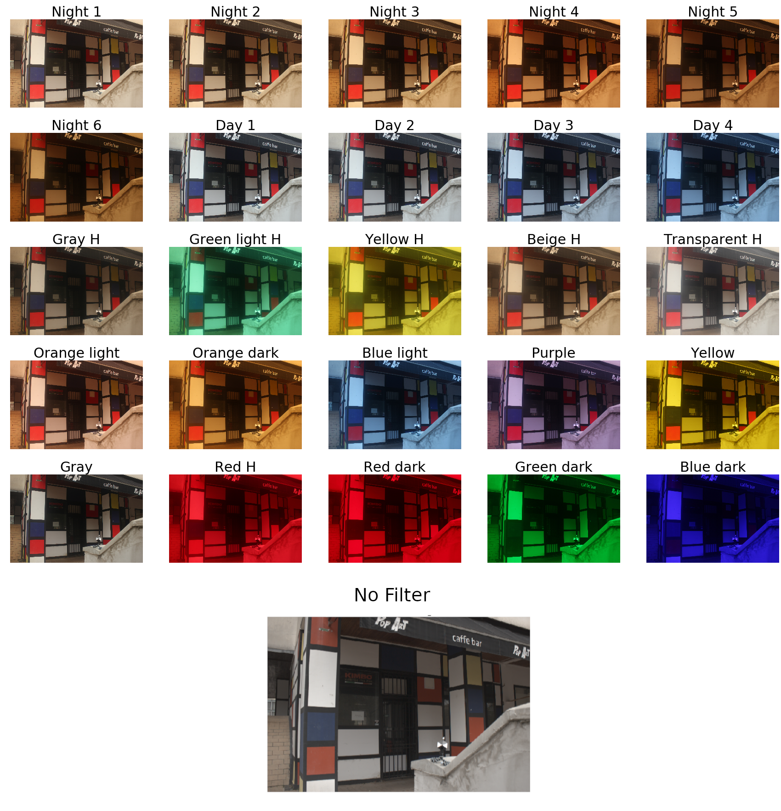
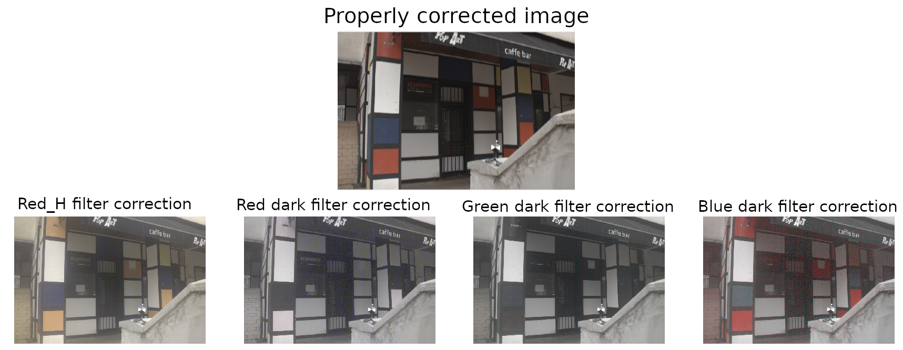

[Home](./)

# Filters & Lumination: Creating multi-illuminant images for computational color constancy

There are some limitations in the Shadows & Lumination dataset. It only contains images with 2 light sources and the images contain no regions with non-uniform illumination. Because of these reasons I developed a method for the creation of multi-illuminant images with an arbitrary number of images with non-uniform illumination. The method was designed so that the illumination mask creation required no manual labeling. This is achieved by taking multiple images of the same scene where the only difference between the images is the scene illumination. To achieve this lighting color filters were placed in front of the camera lens.
In a normal real world image the values of a pixel depend on three factors, scene illumination color, surface reflectance of objects in the scene and the camera sensitivity function. 

$$
    \textbf{l} =
    \begin{bmatrix}
    l_{R} \\
    l_{G} \\
    l_{B}
    \end{bmatrix}  = \int_{\omega}I(\lambda)S(\textbf{x},\lambda)p(\lambda)  \,d\lambda
$$

By placing the lighting filter in front of the camera lens we efectivelly add another factor that infuences a pixels value.

$$
    \textbf{l} =
    \begin{bmatrix}
    l_{R} \\
    l_{G} \\
    l_{B}
    \end{bmatrix}  = \int_{\omega}F(\lambda)I(\lambda)S(\textbf{x},\lambda)p(\lambda)  \,d\lambda
$$

We can then combine the illumination color with the lighting filter color which results in the original formula. With this we efectively changes the scene illumination without editing the scene.

$$
    \textbf{l} =
    \begin{bmatrix}
    l_{R} \\
    l_{G} \\
    l_{B}
    \end{bmatrix}  = \int_{\omega}I'(\lambda)S(\textbf{x},\lambda)p(\lambda)  \,d\lambda
$$

* * *

Here is an example of how the filters infulence the scene and the results of when extreme filters are used.

{:refdef: style="text-align: center;"}
{:style=" margin-left: -12.5%; max-width : 125%; border: 5px;" }
{:refdef}

***

Here we see the effects of the extreme filters. We see that if the lighting filter supresses too much of the visible spectre the color information gets lost.

{:refdef: style="text-align: center;"}
{:style=" margin-left: -25%; max-width : 150%; border: 5px;" }
{:refdef}

***

## Paper abstract
White-balancing is a very important process for anyone who deals with photography. It is present in every digital camera, and 
it has a significant influence on how an image will look. 
It removes the chromatic effect of scene illumination so that the final image looks as though it is illuminated by a perfectly white light.
This needs to be done so that images look natural. The Human Visual System does this and without white-balancing digital images look odd.
Many methods have been developed, and it was shown that the best results are obtained using learning-based methods. Learning-based methods rely on large, diverse datasets for
proper training and evaluation. While there are many datasets with images affected by a single uniform illuminant, 
thorough research on images affected by multiple illuminants has only recently started. To help with such research, in this paper we propose a
new way to create multi-illuminant color constancy images. With our approach, images of a diverse set of scenes with a variable number of illuminants can be created. 
Our approach also includes an automatic way to create a per-pixel illumination mask for each image. We used around 100 different scenes to evaluate our dataset creation approach. We also evaluate several methods from the literature on our images.

* * *

## Link to paper [https://doi.org/10.1145/3589883.3589909](https://doi.org/10.1145/3589883.3589909)  
If the DOI Not Found website is reached the paper has not yet been uploaded. Waiting for the ICMLT conference to upolad the proceesings.

