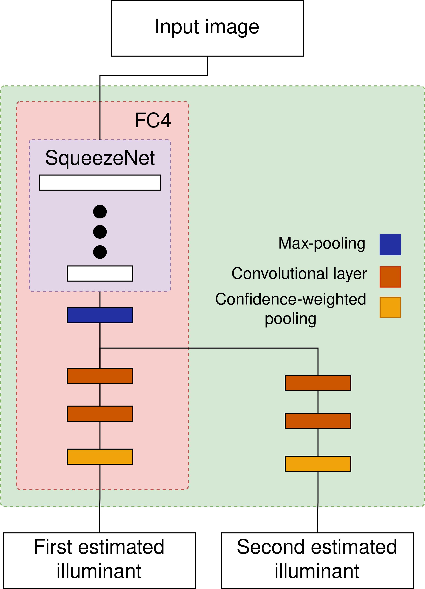

[Home](./)

# Outdoor daytime multi-illuminant color constancy

This reseach paper was created during the initial stages of the creation of large scale multi-illuminant dataset.
Existing methods that perform illumination estimation in multi-illuminant images divide the image into 
small patches and perform illumination estimation for each patch seperately.
Such a approach simplifies the estimation process with the assumption that since the patche are small they contain only one illuminant.
The problem with this approach is that small patche usually dont contain enough information for proper illumination estimation.
An example being a yellow wall where without additonal information we cannot know whether the wall is yellow and the color of the light is white or the wall is white and color of the light is yellow or any other combination of wall and light color.
Here I wanted to see if a neural network that takes the entire image as an input will produce better results than methods that divide the image into patches.
For this I used an existing ste-of-the-art single illuminant estimation method and edited it for multi illuminant estimation. Experiments showed that such an apporach out performs neural networks that divide the image into patches.

* * *

## Paper abstract
White-balancing is an important part of the image processing pipeline and is used in many computer vision applications. It removes the chromatic influence of the illumination on objects in the scene. White balancing is important in tasks such as object detection and object tracking. This problem is tackled in a myriad of ways, but most methods use the assumption that images contain only one dominant uniform illuminant. In recent years, neural networks have been used to create state-of-the-art methods for single illuminant white-balancing, but the problem of multi-illuminant white-balancing has been largely ignored. The main reason for this is the lack of multi-illuminant datasets. In this paper, we introduce a convolutional neural network for multi-illuminant (sun and shadow) illumination estimation. For the training and testing of the created model over 100 outdoor daytime images were taken using the Canon EOS 550D camera. We show that the model outperforms existing statistics-based methods on the test data.

* * *

{:refdef: style="text-align: center;"}
{: width="70%" }
{: refdef}

* * *

## Link to paper [https://doi.org/10.1109/ISPA52656.2021.9552092](https://doi.org/10.1109/ISPA52656.2021.9552092)

