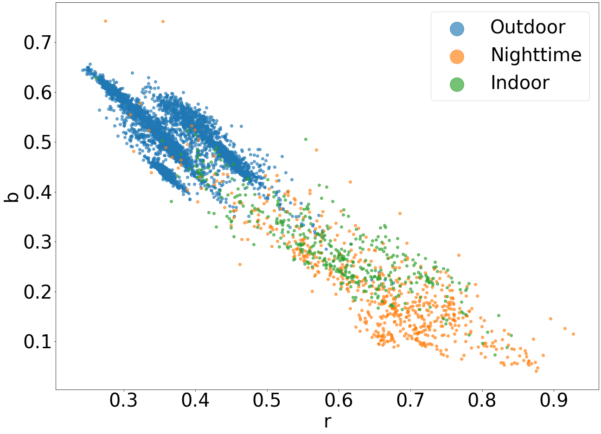

[Home](./)

# Outdoor daytime multi-illuminant color constancy

Since there are not many color constancy datasets that contain images with multiple illuminants an important part of the research was the creation of a large-scale multi-illuminant dataset.
The problem with images that contain multiple illuminants is that to create the illumination ground truth one needs to label the effect each illuminant has on each pixel. When real-world images contain non-uniform illumination this is near-impossible. Because of this, I created a dataset with images where the labeling process is simplified. Images in the dataset contain two images, an ambient light present in the entire image and a stronger direct light that illuminates only a part of the image scene. An example of such a situation is a sunny day where the sun is the direct light and the sky is the ambient light. Such situations have a clear border between illumination regions which significantly simplifies the labeling process. With this method, a diverse set of 2500 images from various daytime, nighttime, indoor, and outdoor scenes was created. To make the dataset as diverse as possible 5 different cameras were used. Extensive tests were also performed to show that the extracted light colors and the created illumination masks were appropriate for each image and that the two light sources were different enough from one another.

* * *

## Paper abstract
In this paper, we introduce a new large-scale publicly available color constancy dataset which we are calling the Shadows & Lumination dataset. The dataset contains 2500 minimally processed images from various indoor, outdoor, and night-time scenes. This dataset is GDPR-compliant, as we masked out all sensitive private information from the images. Unlike most other color constancy datasets, our dataset contains real-world images with two illuminants is appropriate for multi-illuminant estimation. In addition to the illumination, we provide a binary segmentation mask for each image. In the segmentation mask, we divide the image into two regions, where each region is illuminated by only one of the illuminants. We give an explanation of the methodology used to create the dataset. For dataset creation, we used five cameras: Canon 5D, Canon 550D, Sony , Panasonic FZ1000, and the Motorola one fusion+ mobile camera. Finally, we tested several state-of-the-art illumination estimation and image segmentation models on our dataset. The dataset is publicly available1. This paper also benchmarks several illumination estimation methods as well as several image segmentation methods on our dataset.

* * *

Here we can see some example images for the dataset and a graph that showcases the diversity of the light source colors present in the dataset.

{:refdef: style="text-align: center;"}
{:style=" margin-left: -25%; max-width : 150%; border: 5px;" }
{:refdef}

***

{:refdef: style="text-align: center;"}
{: width="75%" }
{:refdef}

* * *

## Link to paper [https://doi.org/10.1016/j.eswa.2023.120045](https://doi.org/10.1016/j.eswa.2023.120045)
## Link to dataset [http://bit.ly/shal_dataset](http://bit.ly/shal_dataset)

